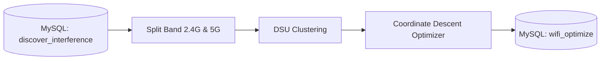

# wifiopt

Tool Rust untuk memindahkan channel Wi-Fi (2.4 GHz & 5 GHz) yang bentrok dengan tetangga ke channel paling sepi.

---

## Data Pipeline



---

## Real Data Example

### 1. Raw Input
Table: `discover_interference_reborn_20260817_reg1`  
Serial Number: `485754432288A0B6`

- **`json_config` (Own AP Config):**
  - Slot 1 (2.4 GHz): BSSID `9C:BF:CD:2D:22:84`, active channel 6.
  - Slot 5 (5 GHz): BSSID `9C:BF:CD:2D:22:88`, active channel 149.
- **`json_neighbor` (Detected Neighbors):**
  - 3 AP di channel 6 (RSSI -53 s.d. -78 dBm).
  - 2 AP di channel 7 (RSSI -66 & -70 dBm).

### 2. Cost Calculation & Decision
- **Channel 6 (current):** Bentrok dengan 5 neighbor di channel 6 & 7. Interference cost = `2.68`.
- **2.4 GHz Candidate Channels `[1, 6, 11]`:**
  - Channel 11: Masih kena adjacent overlap dari neighbor di channel 7.
  - Channel 1: Bersih dari neighbor interference. Cost = `0.0`.
- **Decision:** Switch channel dari 6 ke 1.

### 3. Output Table
Table: `wifi_optimize_20260817`

```json
{
  "reg": "reg1",
  "sn": "485754432288A0B6",
  "clusterid_2g": 4,
  "ch_before_2g": 6,
  "cost_before_2g": 2.68,
  "ch_after_2g": 1,
  "cost_after_2g": 0.0,
  "status_2g": "CHANGE",
  "ch_before_5g": 149,
  "cost_before_5g": 0.0,
  "ch_after_5g": 149,
  "cost_after_5g": 0.0,
  "status_5g": "STAY"
}
```

---

## Interference Cost Formula

$$\text{Cost} = \sum \text{Overlap} \times \text{OwnerFactor} \times \text{TypeFactor} \times \text{RSSIFactor}$$

- **Candidate Channels:**
  - 2.4 GHz: `[1, 6, 11]`
  - 5 GHz: Non-DFS (`36, 40, 44, 48, 149, 153, 157, 161, 165`)
- **Owner Factor:** `OWN_GATEWAY = 0.50`, `EXTERNAL = 1.00`.
- **Type Factor:** Co-channel = `1.00`, Adjacent-channel = `1.20`.
- **RSSI Factor:** $\ge -50\text{ dBm}$ (1.00), $\ge -60$ (0.80), $\ge -70$ (0.60), $\ge -80$ (0.30), $< -80$ (0.10).

---

## Configuration (`config.json`)

```json
{
  "cluster": {
    "min_size": 2
  },
  "optimize": {
    "stale_threshold": 50
  },
  "cron": {
    "timezone": "Asia/Jakarta",
    "hour": 16,
    "minute": 30,
    "date": 0
  }
}
```

---

## Menjalankan Aplikasi

### CLI (Manual)
```bash
# Semua regional (hari ini)
cargo run --release

# Tanggal spesifik
cargo run --release -- --date 20260817

# Regional spesifik
cargo run --release -- --date 20260817 --reg 1
```

### Docker (App + Scheduler)
Container membungkus binary Rust (`/usr/local/bin/wifiopt`) sekaligus background scheduler (`/entrypoint.sh`). Container akan standby di background dan otomatis mengeksekusi binary `wifiopt` setiap hari sesuai jadwal di `config.json` (default `16:30 WIB`). Setelah selesai, memori langsung di-release dan container kembali idle menunggu jadwal berikutnya.

```bash
# Build dan jalankan
docker compose up --build -d

# Cek status & log eksekusi
docker compose logs -f
```

