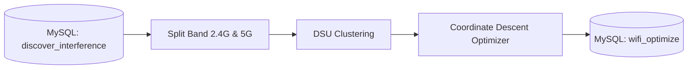

# wifiopt

Rust-based Wi-Fi channel optimization engine for 2.4 GHz and 5 GHz bands to resolve co-channel and adjacent-channel interference.

---

## Data Pipeline



---

## Real Data Example

### 1. Raw Input
Table: `discover_interference_reborn_20260817_reg1`  
Serial Number: `485754432288A0B6`

- **`json_config` (Own AP Config):**
  - Slot 1 (2.4 GHz): BSSID `9C:BF:CD:2D:22:84`, active channel 6.
  - Slot 5 (5 GHz): BSSID `9C:BF:CD:2D:22:88`, active channel 149.
- **`json_neighbor` (Detected Neighbors):**
  - 3 APs on channel 6 (RSSI -53 to -78 dBm).
  - 2 APs on channel 7 (RSSI -66 & -70 dBm).

### 2. Cost Calculation & Decision
- **Channel 6 (current):** Clashes with 5 neighbors on channel 6 & 7. Interference cost = `2.68`.
- **2.4 GHz Candidate Channels `[1, 6, 11]`:**
  - Channel 11: Still affected by adjacent-channel overlap from neighbors on channel 7.
  - Channel 1: Clean from neighbor interference. Cost = `0.0`.
- **Decision:** Switch channel from 6 to 1.

### 3. Output Table
Table: `wifi_optimize_20260817`

```json
{
  "reg": "reg1",
  "sn": "485754432288A0B6",
  "clusterid_2g": 4,
  "ch_before_2g": 6,
  "cost_before_2g": 2.68,
  "ch_after_2g": 1,
  "cost_after_2g": 0.0,
  "status_2g": "CHANGE",
  "clusterid_5g": null,
  "ch_before_5g": 149,
  "cost_before_5g": 0.0,
  "ch_after_5g": 149,
  "cost_after_5g": 0.0,
  "status_5g": "STAY"
}
```

---

## Interference Cost Formula

$$\text{Cost} = \sum \text{Overlap} \times \text{OwnerFactor} \times \text{TypeFactor} \times \text{RSSIFactor}$$

- **Candidate Channels:**
  - 2.4 GHz: `[1, 6, 11]`
  - 5 GHz: Non-DFS (`36, 40, 44, 48, 149, 153, 157, 161, 165`)
- **Owner Factor:** `OWN_GATEWAY = 0.50`, `EXTERNAL = 1.00`.
- **Type Factor:** Co-channel = `1.00`, Adjacent-channel = `1.20`.
- **RSSI Factor:** $\ge -50\text{ dBm}$ (1.00), $\ge -60$ (0.80), $\ge -70$ (0.60), $\ge -80$ (0.30), $< -80$ (0.10).

---

## Configuration (`config.json`)

```json
{
  "cluster": {
    "min_size": 2
  },
  "optimize": {
    "stale_threshold": 50
  },
  "cron": {
    "timezone": "Asia/Jakarta",
    "hour": 19,
    "minute": 30,
    "date": 0
  }
}
```

---

## Usage

### CLI (Manual Execution)
```bash
# Process all regions for today
cargo run --release

# Process a specific date
cargo run --release -- --date 20260817

# Process a specific region on a specific date
cargo run --release -- --date 20260817 --reg 1
```

All fields in `config.json` are required — missing or empty config aborts execution (no built-in defaults).

### Docker (App + Background Scheduler)
The container packages the Rust binary (`/usr/local/bin/wifiopt`) and background scheduler (`/entrypoint.sh`). It runs in the background and executes `wifiopt` daily according to the schedule in `config.json` (e.g. `19:30 WIB`). Memory is released immediately after each run.

```bash
# Build and run container
docker compose up --build -d

# View status & logs
docker compose logs -f
```
